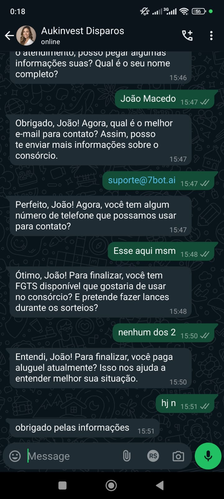
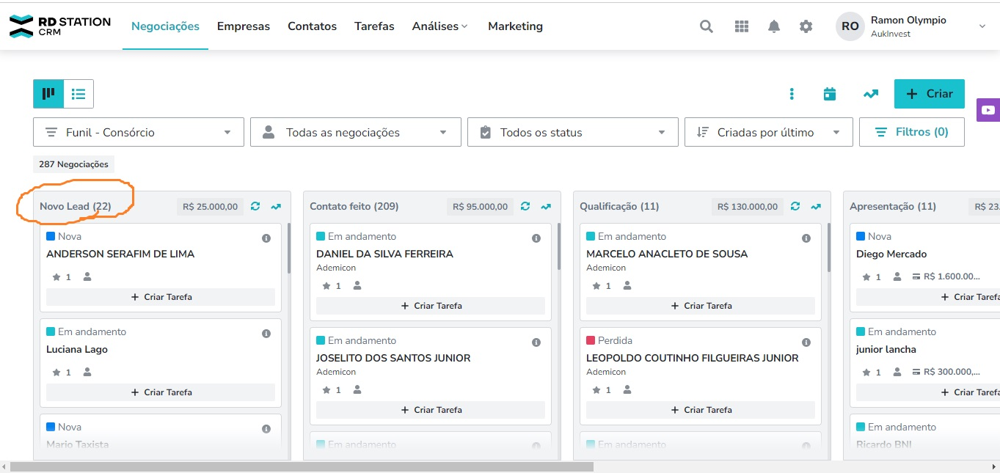
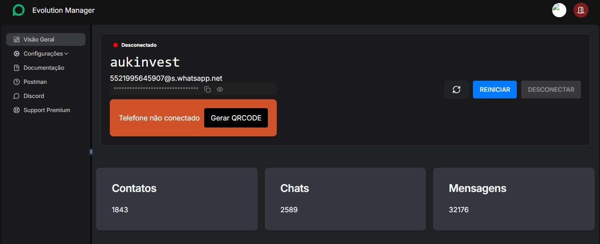
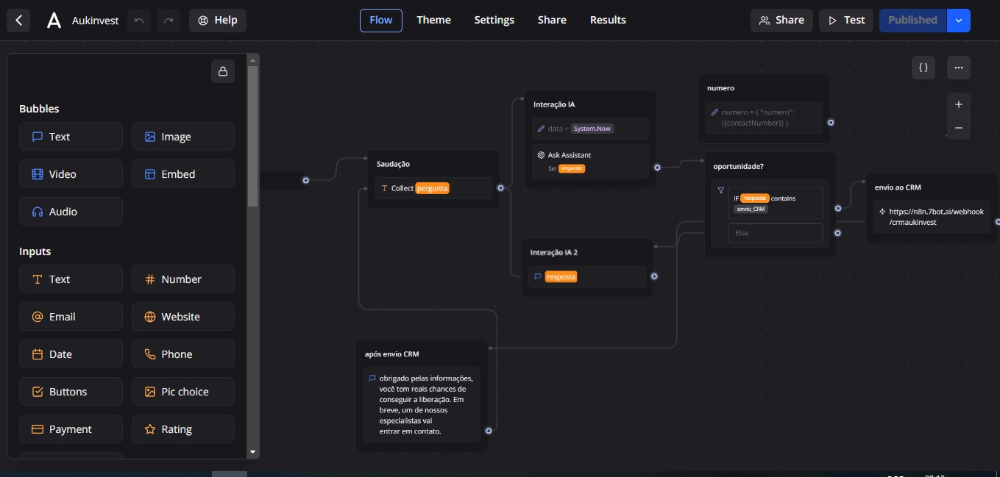
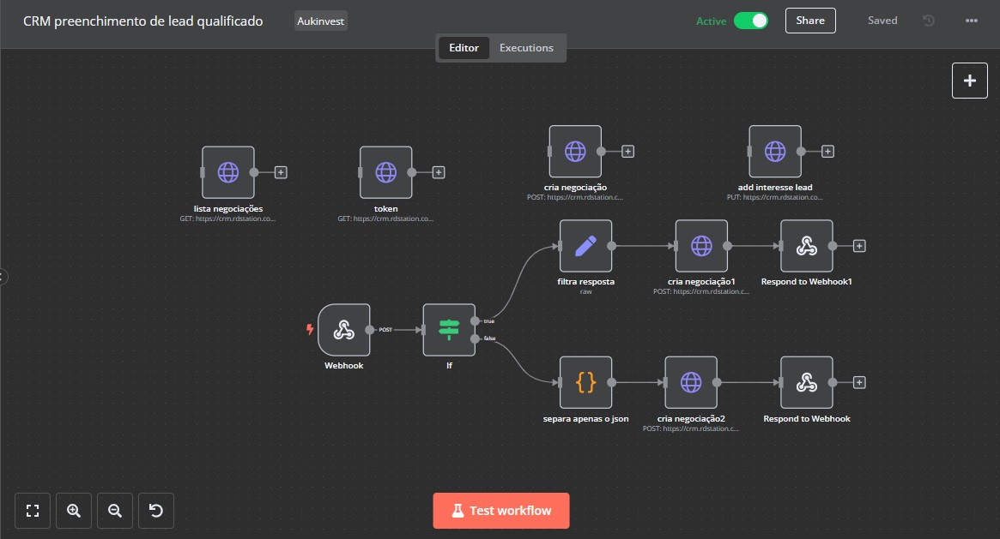

# Clara_AI_lead_qualifier

This repository contains a bot that uses AI to qualify leads for a consortium company and register them automatically on its CRM system

## Strategy

The main plan is that, through a WhatsApp chat, any potential customer will be interviewed by a personalized AI, following the company's criteria to be considered as an opportunity or not.

  
  

If so, the bot automatically registers the customer's data on the company's CRM system.

## Why is this valuable?

The main advantage is that customers can be qualified 24/7 and their data saved for later easy access, which optimizes consultants' time and work and leverages client-net expansion.

## Requirements

WhatsApp is widely used in Brazil. To make automation within the platform, an API platform (Evolution API) was used, as shown in the panel below, and a valid WhatsApp account needs to be connected:

This is a non-official Brazilian open-source API that requires a VPS. Further information can be found here: [Evolution API Documentation](https://doc.evolution-api.com/v2/en/get-started/introduction)

Furthermore, the bot is integrated with a Typebot flow (1st picture below) and N8N flow (2nd picture below):

  

Therefore, Typebot has a function that enables direct connection with an OpenAI assistant, whose script can be accessed here:

[Clara AI Script](clara_ai_script.pdf)

If the AI decides the customer is a good lead, it sends the data to N8N. This is possible through a webhook integration done in the HTTP request bubble on Typebot.

The complete flows can be found here:

Typebot: [Typebot Export File](typebot-export-aukinvest-dn8cn78.json)  
N8N: [N8N CRM Flow](CRM_preenchimento_de_lead_qualificado.json)

